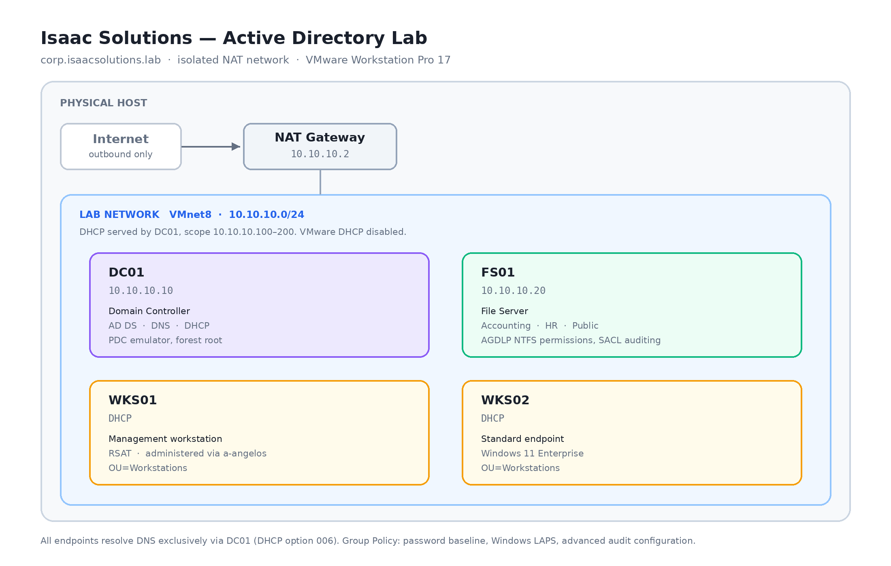
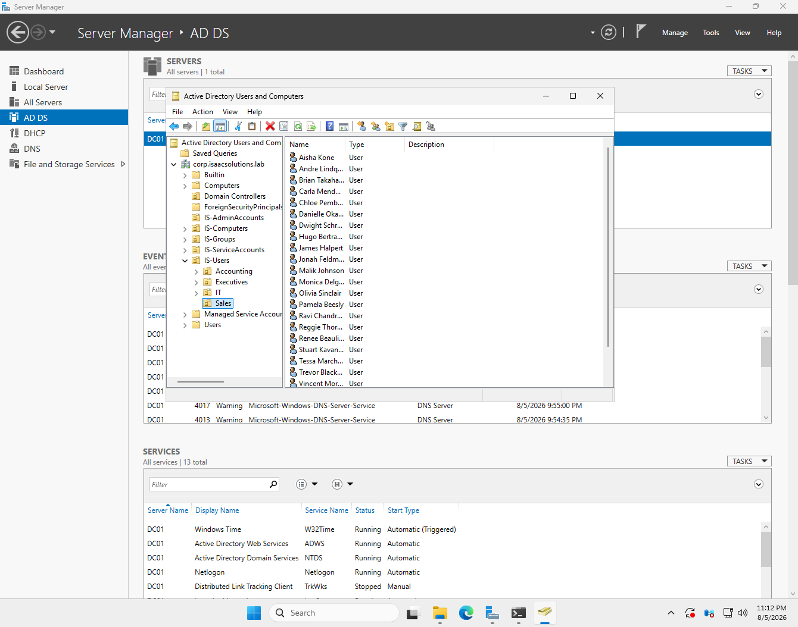
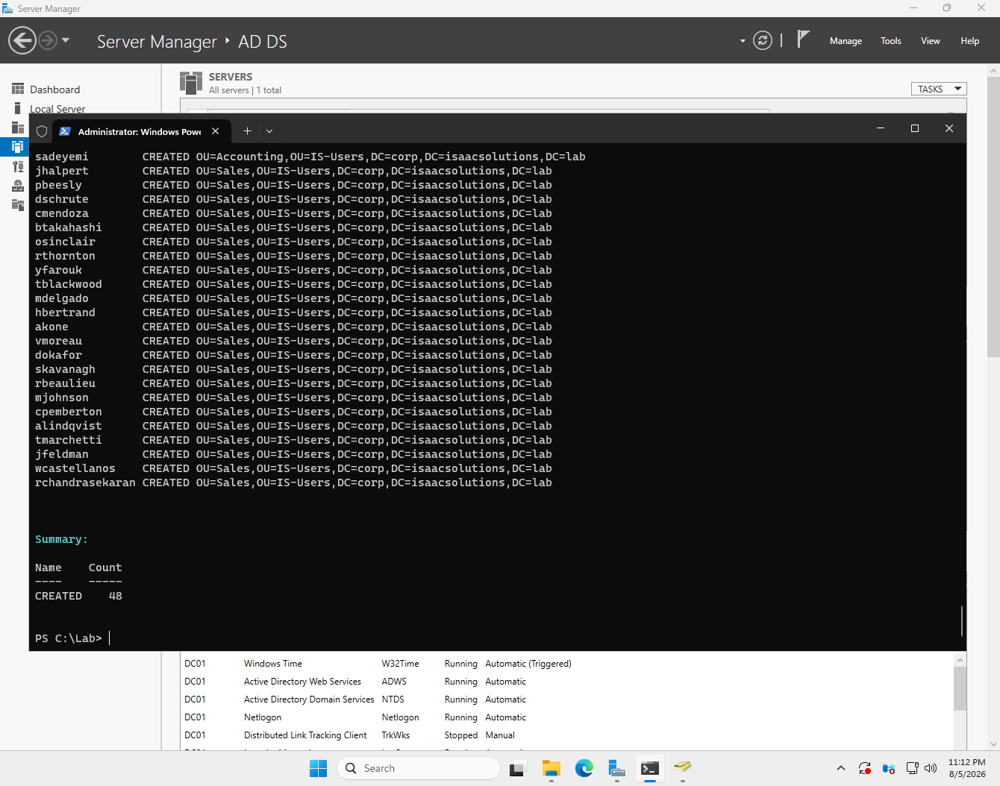
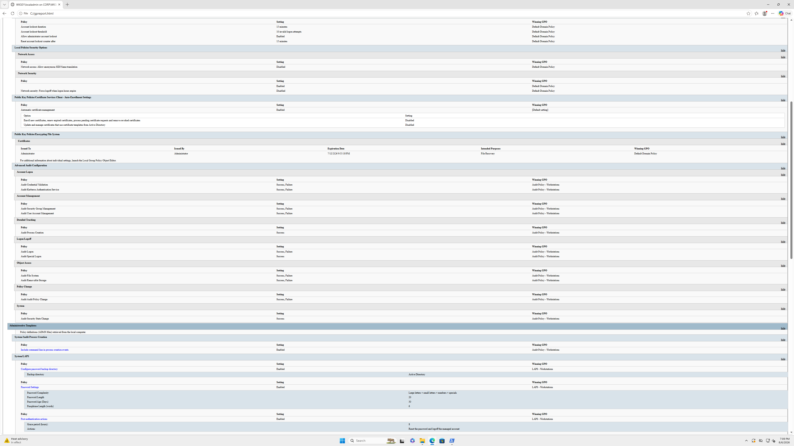
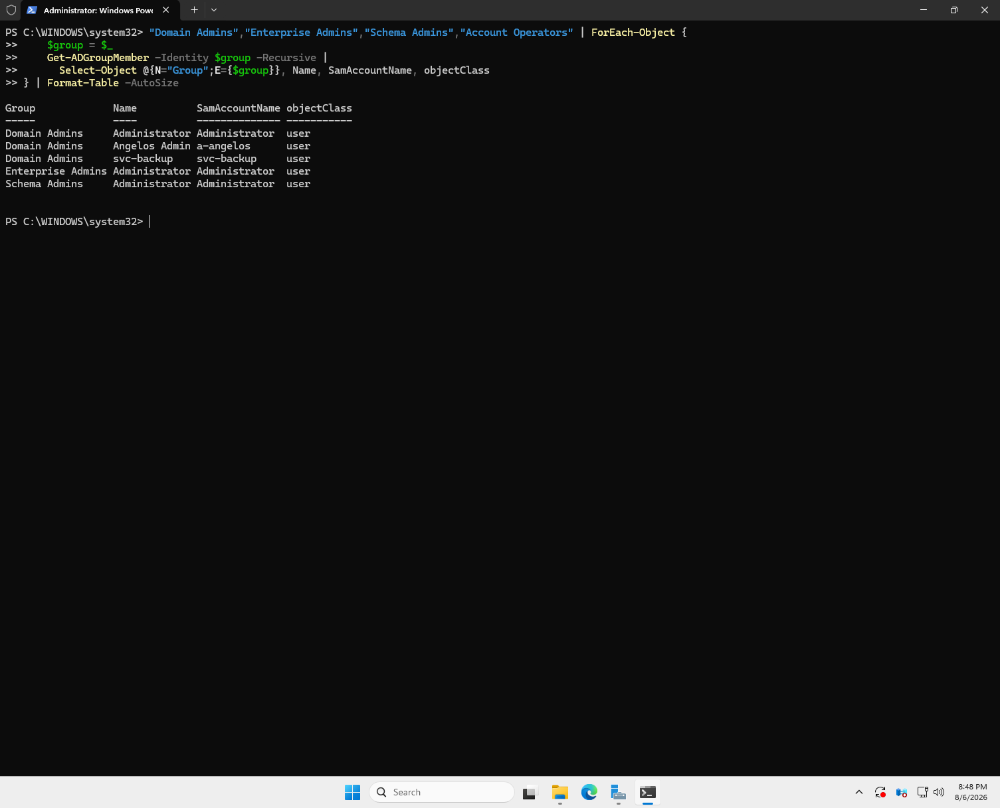
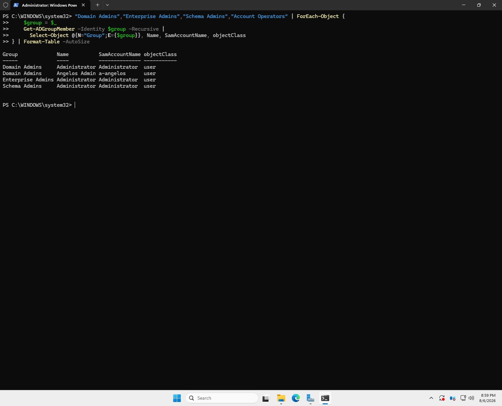
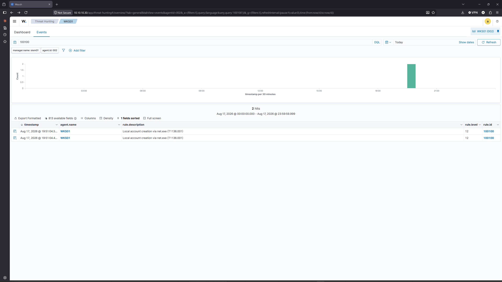

# Active Directory Lab — Isaac Solutions

Windows Server 2025 Active Directory lab — Group Policy hardening, a CIS Controls v8 access review, and Sysmon/Wazuh detection engineering



---

## Overview

This lab simulates a small business network running Active Directory Domain Services. It was built to develop hands-on experience with the identity infrastructure used by most enterprise environments, and then reviewed as a control environment rather than left as a configuration exercise.

**What it covers**

- Forest and domain deployment with integrated DNS and DHCP
- Organizational Unit design supporting targeted Group Policy and delegation
- Automated user provisioning via PowerShell with rollback and audit logging
- Group Policy for password baselines, Windows LAPS, and advanced audit configuration
- Least-privilege file share access using the AGDLP model, with object access auditing
- An access control review against CIS Controls v8, remediated and retested with evidence
- Host telemetry with Sysmon and Wazuh, attack simulation, and custom detection rules

---

## Environment

| Host | Role | OS | IP |
|---|---|---|---|
| DC01 | Domain controller, DNS, DHCP | Windows Server 2025 | 10.10.10.10 |
| FS01 | File server | Windows Server 2025 | 10.10.10.20 |
| WKS01 | Management workstation (RSAT) | Windows 11 Enterprise | DHCP |
| WKS02 | Standard endpoint | Windows 11 Enterprise | DHCP |
| SIEM01 | Wazuh manager, indexer, dashboard | Ubuntu Server 24.04 LTS | 10.10.10.30 |

**Domain:** `corp.isaacsolutions.lab` (NetBIOS `CORP`)
**Subnet:** `10.10.10.0/24`, isolated NAT network
**Hypervisor:** VMware Workstation Pro 17
**Scale:** 51 enabled accounts across four departmental OUs



Users and computers are separated at the top level because Group Policy has two independent halves, and a GPO linked to a container holding both object types has half its settings ignored. Departments sit beneath `IS-Users` so company-wide policy is written once and department-specific policy attaches lower down. Service and admin accounts are isolated so they can be enumerated and monitored as a set.

Full design rationale: [`docs/00-architecture.md`](docs/00-architecture.md)

---

## Documentation

| Document | Contents |
|---|---|
| [Architecture](docs/00-architecture.md) | Design decisions, address plan, naming conventions |
| [Host and network setup](docs/01-host-and-network-setup.md) | Hypervisor configuration, virtual networking |
| [Domain controller build](docs/02-domain-controller-build.md) | Forest deployment and verification |
| [DNS and DHCP](docs/03-dns-and-dhcp.md) | Zone configuration, scope options, authorization |
| [OU design and provisioning](docs/04-ou-design-and-provisioning.md) | Structure rationale, bulk user creation |
| [Client onboarding](docs/05-client-onboarding.md) | Domain join, RSAT management workstation |
| [Group Policy](docs/06-group-policy.md) | Password policy, LAPS, audit configuration |
| [File server and permissions](docs/07-file-server-and-permissions.md) | AGDLP implementation, share auditing |
| **[Failure log](docs/failure-log.md)** | Problems encountered and how they were diagnosed |
| [Lessons learned](docs/lessons-learned.md) | Retrospective |
| [Logging and detection](docs/08-logging-and-detection.md) | Sysmon, Wazuh SIEM, attack simulation, custom detection rules |

---

## Selected work

### Automated user provisioning

[`scripts/provisioning/New-LabUsers.ps1`](scripts/provisioning/New-LabUsers.ps1)

Creates AD accounts from CSV input, placing each into its department OU and adding it to the appropriate global security group per the AGDLP model.

```powershell
.\New-LabUsers.ps1 -CsvPath .\users.csv
```



48 accounts provisioned across four departmental OUs in a single run.

**Design features**

- Idempotent — existing accounts are skipped, so the script is safe to re-run
- Rollback on partial failure — `New-ADUser` writes the account object before applying the password, so a rejected password would otherwise leave an unusable account that later runs skip as "already exists"
- Per-row error handling — one bad record does not halt the batch
- Audit log — CSV of every CREATED / SKIPPED / FAILED result

The rollback logic exists because the first run left 48 half-created accounts behind and the second run reported them all as SKIPPED, which was technically accurate and completely misleading. Written up as [FL-002](docs/failure-log.md).

---

### Group Policy

Four GPOs covering password and lockout policy, Windows LAPS for local administrator password rotation, advanced audit configuration with command line process logging, and item-level targeted drive mappings.



The Winning GPO column is what makes this evidence rather than a screenshot. It shows which GPO won for each individual setting, confirming not just that policy applied but that each setting came from the GPO intended to own it.

Configuration and rationale: [`docs/06-group-policy.md`](docs/06-group-policy.md)

---

### Access control review

[`audit/findings-register.md`](audit/findings-register.md)

A control review of the domain and file server against CIS Controls v8, documenting five findings using standard audit structure — condition, criteria, cause, effect, recommendation. Each was remediated and retested, with before and after evidence in [`audit/evidence/`](audit/evidence/).

| ID | Finding | Severity | Control | Status |
|---|---|---|---|---|
| AD-2026-001 | Accounts configured with non-expiring passwords | Medium | 5.2 | Remediated, retested |
| AD-2026-002 | Service account holds unnecessary Domain Admin membership | High | 5.4 | Remediated, retested |
| AD-2026-003 | Enabled accounts with no logon activity | Low | 5.3 | Scoped |
| AD-2026-004 | Share grants Full Control to Everyone | High | 3.3 | Remediated, retested |
| AD-2026-005 | Direct user assignments on file share ACLs | — | 6.8 | No exceptions noted |

| Before | After remediation |
|---|---|
|  |  |

The register also records one **risk acceptance** rather than a remediation. The built-in Administrator account carries a non-expiring password by default, and allowing it to expire creates a lockout risk with no supported recovery path if no other Domain Admin account is usable. It is documented with compensating controls instead of being fixed, because knowing when not to remediate is part of the judgement.

---

### Detection engineering

[`docs/08-logging-and-detection.md`](docs/08-logging-and-detection.md) · [`detections/`](detections/)

Sysmon deployed across all four Windows endpoints, forwarding to a Wazuh manager on a dedicated Ubuntu host. Attack techniques executed with Atomic Red Team against the domain, and detections written against the resulting telemetry.



**T1136.001, local account creation.** Reading the raw Sysmon event before writing any rule showed that `net.exe` delegates to `net1.exe`, which performs the actual work. A rule matching only `net.exe` would miss any direct invocation of the second binary. Rule 100100 matches both and fires twice, 100 milliseconds apart.

**T1003.001, LSASS credential dumping.** Checking the telemetry before testing revealed that the widely-used SwiftOnSecurity Sysmon config ships with `ProcessAccess` monitoring effectively disabled, meaning credential dumping would generate no process access events at all. After enabling it scoped to LSASS and baselining normal access, the technique itself was blocked by Microsoft Defender before the detection layer was reached.

The rule development took four attempts, three of which produced no error at all. Written up in [FL-005](docs/failure-log.md).

---

## Scripts

| Script | Purpose |
|---|---|
| [`New-LabUsers.ps1`](scripts/provisioning/New-LabUsers.ps1) | Bulk user provisioning from CSV with rollback and logging |
| [`local_rules.xml`](detections/local_rules.xml) | Custom Wazuh detection rules |

All scripts include comment-based help. Run `Get-Help .\ScriptName.ps1 -Full` for details.

---

## Key takeaways

**Empty output is not the same as success.** Three separate failures in this build shared a shape: a command returned nothing, or returned something technically accurate, while the system was in a state I did not expect. Provisioning reported SKIPPED for accounts that were broken. LAPS returned blank because a GPO existed but had never been linked. `New-SmbShare` reported success against paths that did not exist. In each case the answer came from querying the system directly rather than trusting the tool's report of the system.

**Creating a GPO and linking a GPO are separate operations.** All the settings work feels like the task, but a GPO with perfect settings and no link has no effect on anything and produces no warning.

**Auditing has two independent layers.** Audit policy enables a category across endpoints; the SACL specifies which objects within it are watched. Both are required, and applying them in the wrong order silently removes the audit configuration entirely.

**DNS is the dependency everything rests on.** A client with working internet and the wrong DNS server has full connectivity and zero domain functionality. The failure looks nothing like the cause, which is why it is worth checking first every time.

**Check the telemetry exists before writing the detection.** Twice in this build I was about to write a rule against data that was not being collected. Finding that out first is the difference between a detection that works and one that appears to.

---

## Scope and ethics

All systems in this lab are personally owned and run on an isolated virtual network with no route to any production or third-party environment.

---

## References

- Microsoft Learn — Active Directory Domain Services documentation
- CIS Controls v8 and CIS Microsoft Windows Server Benchmarks
- NIST SP 800-63B — Digital Identity Guidelines
- MITRE ATT&CK Enterprise Matrix

---

**Angelos Isaac** — Cybersecurity, Penn State
