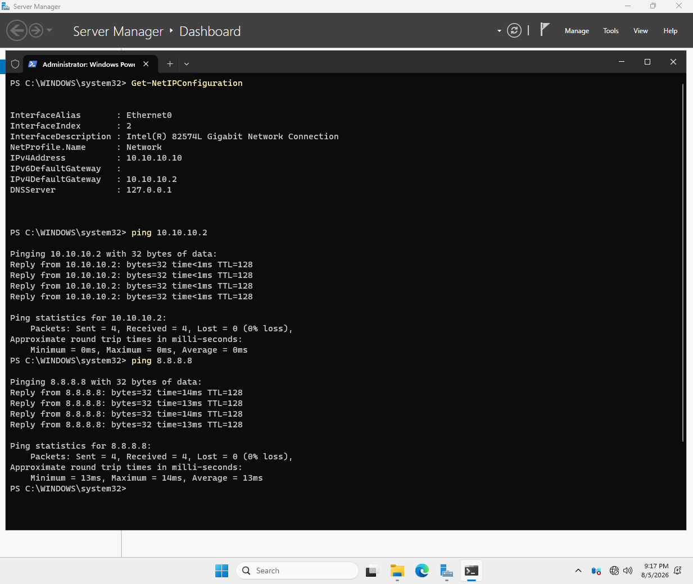
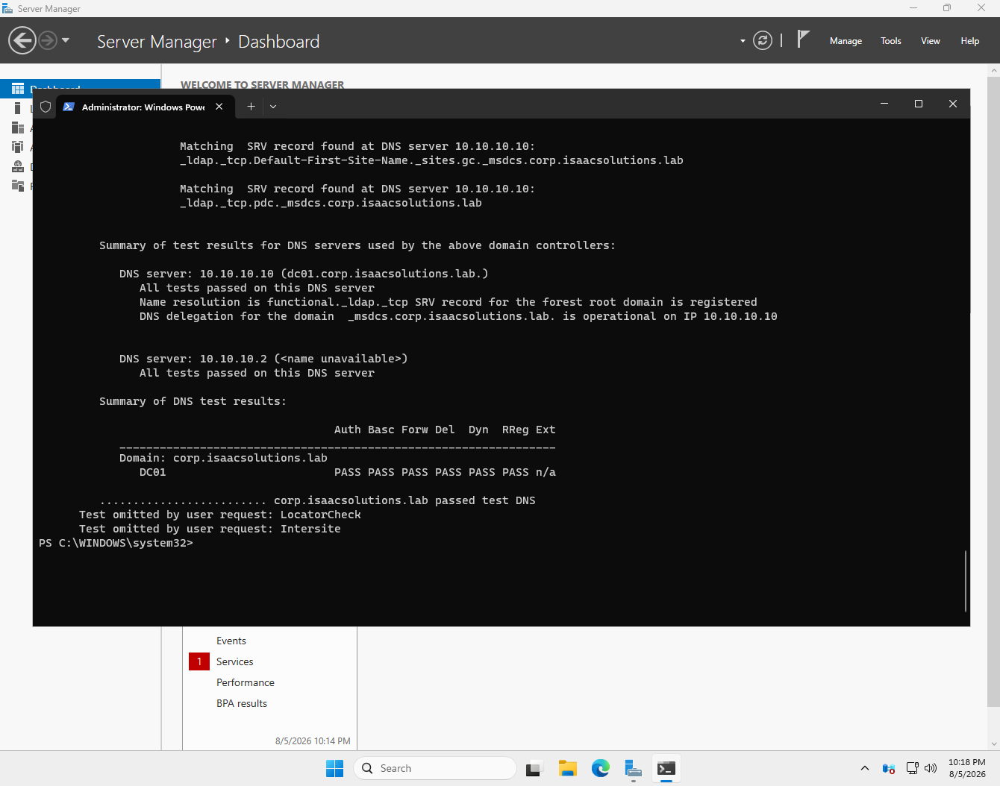
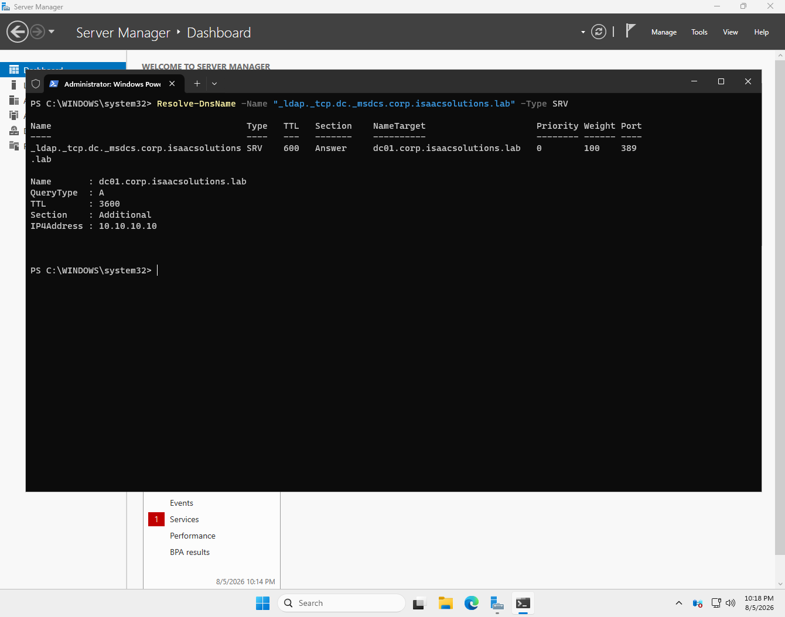

# Phase 2 — Domain controller build

**Status:** Complete  ·  **Date completed:** 2026-08-06  ·  **Systems:** DC01

> Build guide reference: Guide Part 5

---

## Objective

Deploy the first domain controller and forest root, and verify the forest built cleanly before anything else came to depend on it.

---

## Pre-promotion configuration

Static IP `10.10.10.10`, gateway `10.10.10.2`, DNS `127.0.0.1`.

```powershell
$if = (Get-NetAdapter | Where-Object Status -eq "Up").InterfaceIndex

New-NetIPAddress -InterfaceIndex $if -IPAddress 10.10.10.10 `
  -PrefixLength 24 -DefaultGateway 10.10.10.2

Set-DnsClientServerAddress -InterfaceIndex $if -ServerAddresses 127.0.0.1
```

**The DC points at itself for DNS**, which looks wrong and is not. This machine is about to become the DNS server for the domain, and during promotion it registers its own SRV records into its own DNS service. Pointing it at `127.0.0.1` means those registrations resolve locally and immediately. No alternate DNS server is configured: adding a public resolver as a fallback appears to be sensible redundancy and actively breaks things, because Windows will fall back to it during any brief hiccup, receive an authoritative "no such domain" for the internal zone, and cache that negative answer.



*Last verified clean state before promotion. Both checks use IP addresses rather than hostnames, because name resolution does not exist yet — the DNS role is installed by the promotion itself. `Resolve-DnsName` failing at this point is expected, not a fault.*

---

## Forest promotion

```powershell
Install-WindowsFeature AD-Domain-Services -IncludeManagementTools

Install-ADDSForest `
  -DomainName "corp.isaacsolutions.lab" `
  -DomainNetbiosName "CORP" `
  -ForestMode "WinThreshold" `
  -DomainMode "WinThreshold" `
  -InstallDns:$true `
  -DatabasePath "C:\Windows\NTDS" `
  -SysvolPath "C:\Windows\SYSVOL" `
  -Force:$true
```

**The DSRM password.** Promotion prompts for a Safe Mode Administrator Password. Directory Services Restore Mode boots Windows with Active Directory offline so the database can be repaired or restored. Because AD is down in that mode, domain credentials cannot authenticate, which is why a separate local password exists. It is needed only if the database is ever corrupted, which is precisely why almost nobody remembers setting it.

**Delegation warnings during promotion are expected.** The installer reported twice that a delegation for this DNS server could not be created, once for the forward zone and once for the reverse zone. DNS delegation is how a parent zone points at a child zone, and `.lab` has no parent that exists — which is the reason it was chosen. In a production environment under a real parent domain this warning would matter. Here it reports something already known.

---

## Verification





The SRV lookup is the record clients use to locate a domain controller. If it returns nothing, nothing else in the domain functions, so it is checked before anything is built on top.

**Reading the dcdiag output honestly.** The first run reported two failures, `DFSREvent` and `SystemLog`. Both scan the previous 24 hours of event logs rather than current state, and every logged error fell inside the promotion window — DFS Replication and the Netlogon client attempting to reach a domain controller before AD had finished starting. The tests that examine live state all passed, including `SysVolCheck` confirming SYSVOL was shared and ready, and `RidManager` showing a healthy identifier pool despite a startup error claiming the pool was depleted.

The environment was rebooted and re-tested to confirm this. Timestamps on the DFSR entries did not advance, and `KccEvent` cleared entirely once its one-time database initialisation events aged out. The remaining `SystemLog` entries recurred at boot and are startup timing artifacts: a `wpad` resolution timeout for a name that does not exist, WinRM not listening because remote management is not in use, and a SAM/KDC handshake logged before both services finish initialising.

**A real item was found in that output.** The DC holds the PDC emulator role and is therefore the authoritative clock for the entire domain, but nothing was telling it what time it was. Kerberos rejects timestamps more than five minutes out of alignment, so this would have surfaced later as domain join failures whose error messages never mention time.

```powershell
w32tm /config /manualpeerlist:"time.windows.com,0x9" /syncfromflags:manual /reliable:yes /update
Restart-Service w32time
w32tm /resync
```

---

## Problems encountered

No blocking issues during promotion itself. The two dcdiag failures were investigated and determined to be historical rather than current, as documented above.

---

## Verification

| Check | Command | Result |
|---|---|---|
| Forest and domain created | `Get-ADForest`, `Get-ADDomain` | `corp.isaacsolutions.lab` |
| DC advertising all roles | `dcdiag /v` → Advertising | DC, LDAP, KDC, time server, GC |
| Locator SRV record registered | `Resolve-DnsName _ldap._tcp.dc._msdcs.corp.isaacsolutions.lab -Type SRV` | `dc01.corp.isaacsolutions.lab:389` |
| Time source authoritative and synced | `w32tm /query /status` | Stratum 5, source `time.windows.com` |
