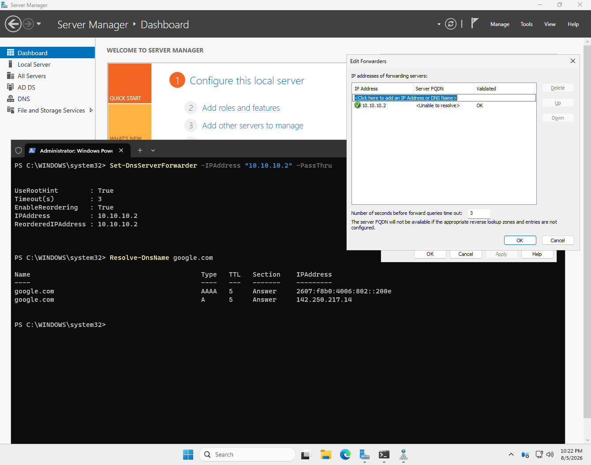
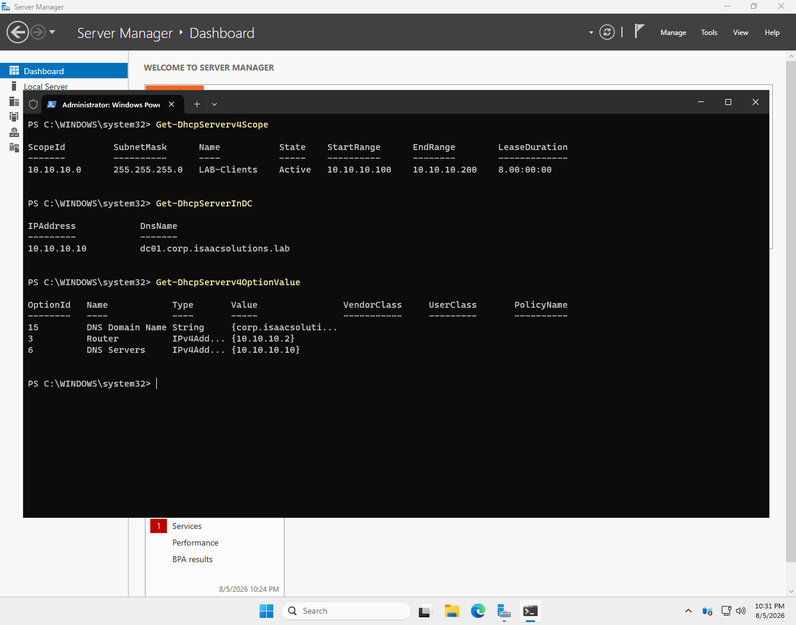

# Phase 3 — DNS and DHCP

**Status:** Complete  ·  **Date completed:** 2026-08-06  ·  **Systems:** DC01

> Build guide reference: Guide Part 6

---

## Objective

Configure name resolution and address assignment so that every domain member points exclusively at the domain controller for DNS, while still resolving external names.

---

## DNS forwarders

```powershell
Set-DnsServerForwarder -IPAddress "10.10.10.2" -PassThru
```



DC01 is authoritative for `corp.isaacsolutions.lab` and nothing else. Any query outside that zone is forwarded to `10.10.10.2`, the NAT device, and the answer is cached. This is what allows every client to point at the domain controller alone and still browse the internet — the two resolution paths are the same path, with the DC in front of it.

The `Server FQDN` column shows `<Unable to resolve>` for the forwarder, which the dialog itself explains: the forwarder's name cannot be resolved until reverse lookup zones exist, and `10.10.10.2` is a VMware NAT device with no name to resolve. The `Validated: OK` status is the field that matters, and it confirms the forwarder answers queries.

**A reverse lookup zone was also created** for `10.10.10.0/24`. Forward DNS answers "what address is DC01," reverse DNS answers "what machine is `10.10.10.10`." Several tools and most security logging depend on reverse lookups working, and alerts carrying hostnames rather than bare addresses are considerably more readable.

---

## DHCP scope and options

| Option | Value | Why |
|---|---|---|
| 006 DNS Server | `10.10.10.10` | Points every client at the domain controller. This is the setting the entire domain depends on. |
| 003 Router | `10.10.10.2` | Default gateway |
| 015 DNS Domain Name | `corp.isaacsolutions.lab` | Allows clients to resolve short names |

Scope `LAB-Clients`, range `10.10.10.100` to `10.10.10.200`, state Active.



**Why option 006 is the one that matters.** Clients do not locate domain controllers by address; they query DNS for SRV records that answer "which server here handles Kerberos" and "which server handles LDAP." A client pointed at any other DNS server cannot find those records, so it cannot authenticate, apply Group Policy, or join the domain — while browsing the web perfectly normally. The failure looks nothing like its cause.

---

## Authorization

```powershell
Add-DhcpServerInDC -DnsName "dc01.corp.isaacsolutions.lab" -IPAddress 10.10.10.10
```

A rogue DHCP server is a classic attack: it hands out its own address as both gateway and DNS server, placing the attacker in the middle of all traffic. In an AD environment, Windows DHCP servers refuse to lease addresses unless their object is authorized in the directory. It is a small control against a real technique, and it costs one command.

---

## Problems encountered

No blocking issues. `Add-DnsServerPrimaryZone` was run twice for the reverse zone and returned `ResourceExists` on the second attempt — the first run had succeeded silently, as most PowerShell cmdlets do. Worth noting because it is the same pattern that caused genuine confusion elsewhere in this build: no output means success, and treating silence as failure leads to re-running commands whose second-attempt errors then look like the real problem.

---

## Verification

| Check | Command | Result |
|---|---|---|
| External resolution working | `Resolve-DnsName google.com` | A and AAAA records returned |
| Scope active and correctly ranged | `Get-DhcpServerv4Scope` | `10.10.10.100-200`, Active |
| Option 006 correct | `Get-DhcpServerv4OptionValue` | `10.10.10.10` |
| Server authorized in AD | `Get-DhcpServerInDC` | `dc01.corp.isaacsolutions.lab` |
| Full DNS health | `dcdiag /test:dns /v` | Auth, Basc, Forw, Del, Dyn, RReg all PASS |
