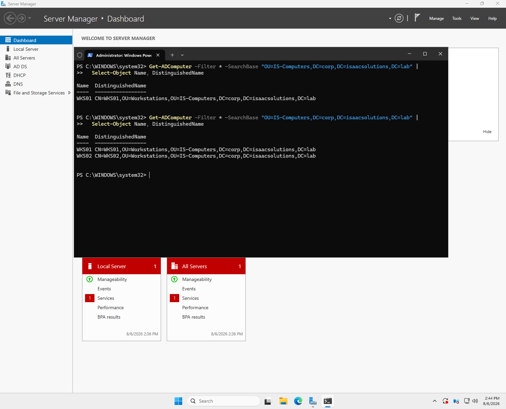

# Phase 5 — Client onboarding

**Status:** Complete  ·  **Date completed:** 2026-08-06  ·  **Systems:** WKS01, WKS02

> Build guide reference: Guide Part 8

---

## Objective

Join endpoints to the domain into the correct OU, and establish a management workstation pattern rather than administering from the domain controller console.

---

## Pre-join verification

```powershell
Get-DnsClientServerAddress -AddressFamily IPv4
Resolve-DnsName "_ldap._tcp.dc._msdcs.corp.isaacsolutions.lab" -Type SRV
nltest /dsgetdc:corp.isaacsolutions.lab
```

DNS is checked before attempting the join because a machine with the wrong DNS server has working internet access and cannot see the domain at all. The join fails with an error that never mentions DNS, so checking first turns a confusing failure into a two-second confirmation.

All three passed on the first attempt. `nltest` returned the DC with its full capability flags — `PDC GC DS LDAP KDC TIMESERV WRITABLE` — confirming the client could see every role the server advertises.

---

## Domain join

```powershell
Rename-Computer -NewName "WKS01" -Restart

Add-Computer -DomainName "corp.isaacsolutions.lab" `
  -OUPath "OU=Workstations,OU=IS-Computers,DC=corp,DC=isaacsolutions,DC=lab" `
  -Credential (Get-Credential) -Restart
```



**`-OUPath` is not optional in practice.** Without it the computer object lands in the default `Computers` container, which is not an organizational unit and cannot have Group Policy linked to it. The machine appears fully joined, authentication works, and no policy ever applies — a silent failure with no error to investigate.

**What a domain join actually does.** The machine authenticates, creates a computer object in the directory, and establishes a machine account password shared between itself and the domain. From that point the computer holds an identity of its own and authenticates independently of any user, which is why a domain-joined machine can apply computer policy and run scheduled tasks before anyone logs in.

---

## Tier 0 considerations

RSAT was installed on WKS01 so Active Directory, DNS, DHCP, and Group Policy can be administered from a workstation rather than from the DC console.

The reason is that when you log into a machine, your credentials stay in that machine's memory while you're logged in. If someone breaks into that machine
and has admin rights on it, they can pull those credentials out. So if I used my Domain Admin account to log into a normal workstation, and that workstation
got compromised, the attacker would end up with control of the whole domain.

RSAT lets me manage AD from WKS01 without logging into the domain controller itself. Real companies take this further with a Privileged Access Workstation, a locked-down machine with no email or web browsing that's only used for administration.

**One thing I realized after setting this up:** WKS01 isn't actually a PAW. It's a normal workstation in the same OU as WKS02 with a browser on it. So if
I log in there as Domain Admin, my credentials are exposed on a general-purpose machine, which is the exact problem this is supposed to avoid. What I've built demonstrates the RSAT mechanic, not real credential isolation.

The proper fix would be either hardening a dedicated machine, or using `runas /netonly` so the credential gets sent to the DC for authentication without being cached locally on the workstation.

**A practical limitation found while setting this up.** Launching GPMC from WKS01 via `runas /netonly` produced a warning that a domain account is required. `/netonly` supplies credentials for outbound network authentication but does not create a local logon session, so the console's own check against the local session still sees a local account. Some management tools expect a full domain session rather than network credentials alone, which is a real constraint on `/netonly` as a workaround.

**Admin account separation.** A dedicated account, `a-angelos`, exists for administration and is not used for browsing or email. The pattern in production is that a person holds two accounts, so that a phishing click on the daily account does not surrender domain control.

---

## Problems encountered

The Active Directory cmdlets fail on WKS01 when run as `localadmin` with "rejected client credentials," because a local account has no identity in the directory to authenticate with. This is the practical friction that makes the Tier 0 argument concrete: you either log in with domain credentials, which places them on the workstation, or you keep working around it.

---

## Verification

| Check | Command | Result |
|---|---|---|
| Both clients in the correct OU | `Get-ADComputer -SearchBase "OU=IS-Computers,..."` | WKS01 and WKS02 under Workstations |
| Client resolving only the DC | `Get-DnsClientServerAddress` | `10.10.10.10` |
| RSAT consoles functional | `dsa.msc`, `gpmc.msc` | Connect to `corp.isaacsolutions.lab` |
