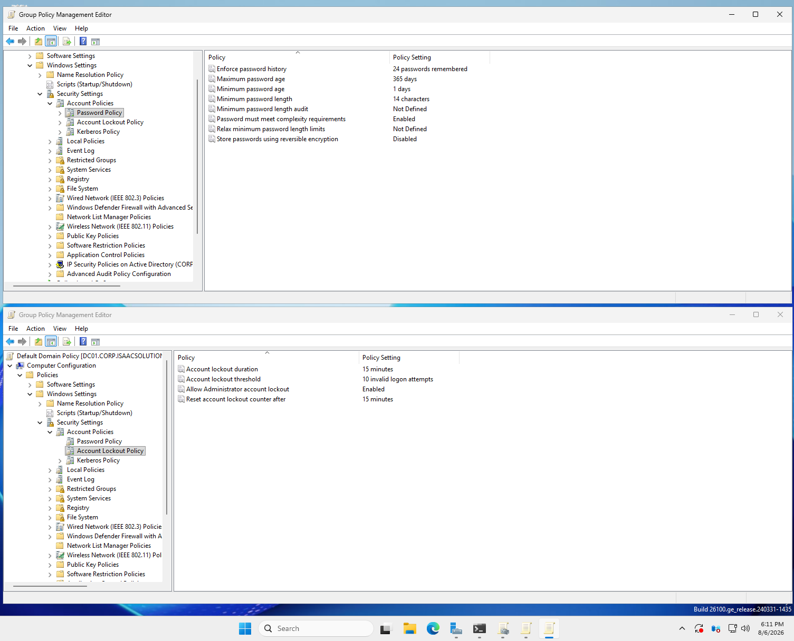
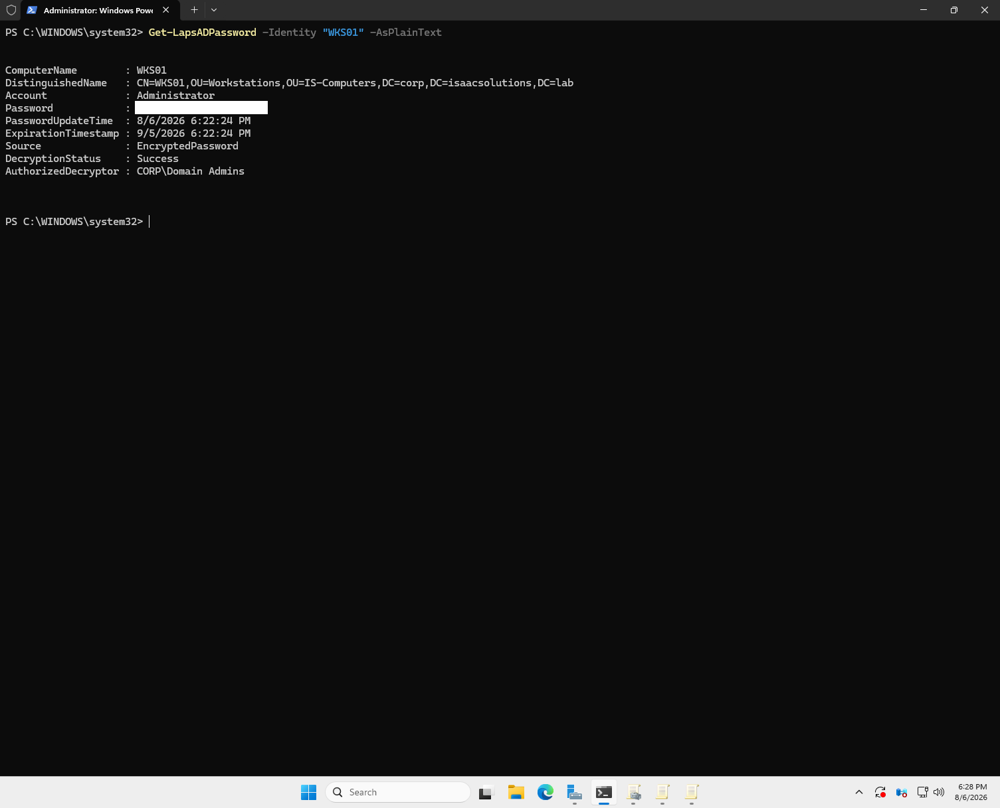
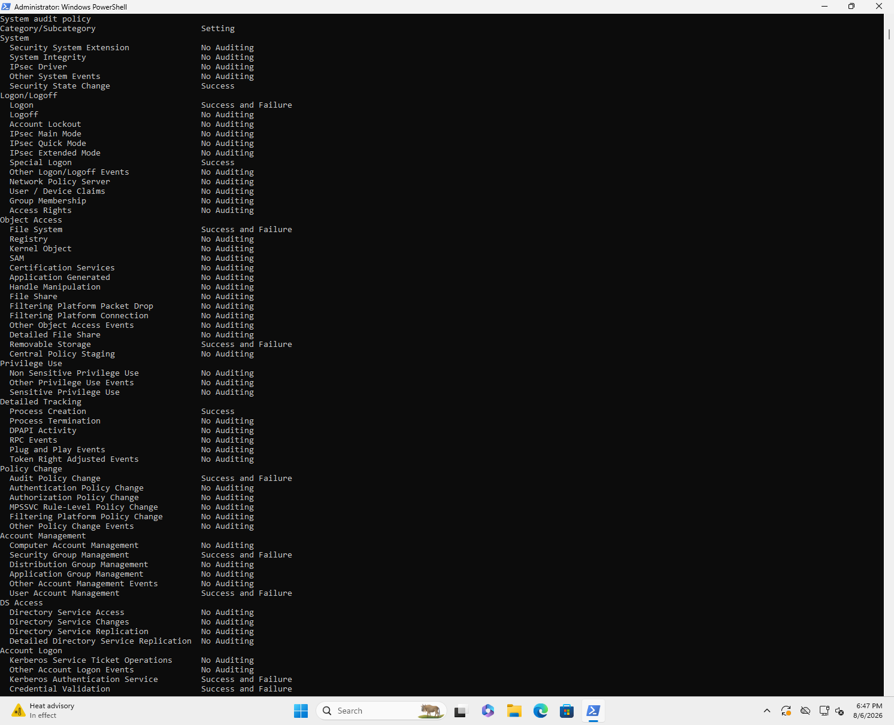

# Phase 6 — Group Policy

**Status:** Complete  ·  **Date completed:** 2026-08-06  ·  **Systems:** DC01, all endpoints

> Build guide reference: Guide Part 9

---

## Objective

Deploy security baselines through Group Policy, and verify they actually reach endpoints rather than merely being configured.

---

## GPO inventory

| GPO | Linked to | Purpose |
|---|---|---|
| Default Domain Policy | Domain | Password and lockout policy |
| `LAPS - Workstations` | IS-Computers | Local admin password rotation |
| `Audit Policy - Workstations` | IS-Computers | Advanced audit + command line logging |
| `Drive Mappings` | IS-Users | Item-level targeted share mapping |

---

## Password and lockout policy

| Setting | Value |
|---|---|
| Minimum length | 14 |
| Maximum age | 365 days |
| History | 24 |
| Lockout threshold | 10 |
| Lockout duration | 15 minutes |

Minimum length 14 instead of 8. Current NIST guidance (SP 800-63B) says length matters more than complexity. A longer password is harder to brute force than a short one with a symbol jammed in, and it's usually easier for people to remember. 14 is also what CIS recommends for a domain.

Maximum age 365 days instead of 90. The old 90 day rule backfires. When you force people to change constantly they just increment what they already have, so Summer2025! becomes Summer2026!, which an attacker can guess. NIST reversed this recommendation for that reason. A year still gives you a rotation point without training people into predictable patterns.

Lockout threshold 10 instead of 5. This is the one I thought about most. Setting it too low turns account lockout into a denial of service tool. An attacker who knows your usernames can deliberately fail logins and lock out every account in the domain without ever guessing a password. Setting it too high lets password spraying work, where someone tries one common password against every account. 10 attempts with a 15 minute auto unlock throttles spraying down to almost nothing while still surviving a user who mistypes their password a few times on a Monday morning.

Lockout duration 15 minutes rather than requiring an admin to unlock. Manual unlock means a helpdesk ticket every time someone fat fingers their password, and it also means an attacker locking accounts creates real operational pain. Auto unlock keeps the throttle without the support burden.

Minimum password age 1 day, kept the Windows default. I left this alone but it's doing something useful. Password history is set to 24, and without a minimum age someone could change their password 24 times in a row to cycle back to the one they wanted. The one day minimum makes that impractical. History and minimum age only work as a pair.

**Fine-grained password policy** on service accounts: 25 characters, no lockout.

Service accounts get different rules because nobody types their passwords. A 25 character password costs nothing when it lives in a configuration file or a managed credential store, so length is free. Lockout is disabled deliberately: a service account that locks out takes an application down with it, so the brute force risk is accepted and compensated for with monitoring instead. A password that long makes brute force irrelevant anyway.

Fine-grained password policy targets a group or a user, never an OU, which is why `GG-ServiceAccounts` exists alongside the `IS-ServiceAccounts` OU. The OU provides Group Policy scope, delegation, and a single place to enumerate service accounts. The group is the only thing an FGPP can attach to. Two mechanisms doing two different jobs on the same set of accounts.

---

## Windows LAPS

Every Windows machine has a built-in local Administrator account. Companies usually build one machine, get it configured, and image that onto everything else, which means every machine ends up with the same local Administrator password. If someone compromises one laptop and pulls that password out of memory, it works on every other machine in the company. That's one of the most common ways ransomware spreads from a single infected machine to the whole network.

LAPS makes each machine generate its own random 20 character password, store it in its own AD computer object, and rotate it every 30 days. A stolen credential now only opens the one machine it came from, and only until the next rotation.

### Watching LAPS take over an account

When I built FS01, Windows Server setup had me set a password during installation. On Server that prompt sets the password for the built-in Administrator account rather than creating a separate named account like Windows 11 client setup does.

After joining FS01 to the domain, it landed in `OU=Servers` under `IS-Computers`, which is where the LAPS GPO is linked. FS01 picked up the
policy, generated its own password, and wrote it to its AD object. The password I set during setup stopped working, and the one from `Get-LapsADPassword -Identity "FS01"` worked instead.

Windows also wouldn't let me change it back. LAPS owns that account now, and setting it manually would leave the machine and AD holding different values, so anyone querying AD would get a password that doesn't work.

Worth noting the gap this leaves: `localadmin` on WKS01 and `localadmin2` on WKS02 are separate accounts I created during Windows 11 setup, so LAPS never
touches them. Their passwords are ones I chose and they never rotate, which is exactly the kind of unmanaged local administrator account that shows up as
an audit finding.

*Password redacted.*

The post-authentication action is the setting that gets overlooked. It is configured to reset the password and log the account off eight hours after an authentication is detected. So even if a credential is captured during an administrative session, it expires on its own without anyone needing to notice the compromise and act on it. Most of the value in LAPS is in unique passwords, but this is the part that limits the damage from a password that was legitimately retrieved and then leaked.

---

## Audit policy

*Verified on the endpoint after `gpupdate /force` — configuring the GPO proves nothing on its own.*

**Command line auditing enabled** — event 4688 records the full command, not just the executable path.

### Known tradeoffs

Enabled command line auditing so event 4688 records the full command rather than just the executable path. Without it a log entry only says PowerShell ran, which is meaningless because PowerShell runs constantly on a healthy machine. With it you can see the arguments, which is where the suspicious activity actually shows up, since attackers mostly use tools already on the system.

The tradeoff is that command lines sometimes contain credentials when scripts are written badly, and enabling this writes those into the Security event log where more people can read them than should. I turned it on anyway because the detection value is worth more, but it means access to the event logs matters more now than it did before.

---

## Verification

*Full chain verified: policy designed, linked correctly, confirmed applied on the endpoint.*

---

## Problems encountered

Initially configured the LAPS settings inside Default Domain Policy. Moved them into a dedicated LAPS - Workstations GPO linked to IS-Computers, because Default Domain Policy should hold only account policy. Keeping unrelated settings in it means you'd have to edit the GPO that controls domain-wide password policy just to change something about LAPS, which is a riskier object to touch than it needs to be. Also found and removed a duplicate link where Default Domain Policy was linked both at the domain root and directly to IS-Computers.

- [FL-003 — LAPS returned nothing at all, with no error](failure-log.md)

---

## Verification

| Check | Command | Result |
|---|---|---|
| All GPOs linked, none orphaned | `Get-GPInheritance -Target "OU=IS-Computers,..."` | Audit Policy and LAPS linked |
| Audit policy reached the endpoint | `auditpol /get /category:*` run on WKS01 | All eleven subcategories set |
| Command line auditing active | `gpresult /h` → System/Audit Process Creation | Enabled |
| LAPS storing and rotating | `Get-LapsADPassword -Identity "WKS01"` | Returns password, `DecryptionStatus: Success` |
| Correct GPO winning per setting | `gpresult /h` → Winning GPO column | Each setting attributed to its intended GPO |
