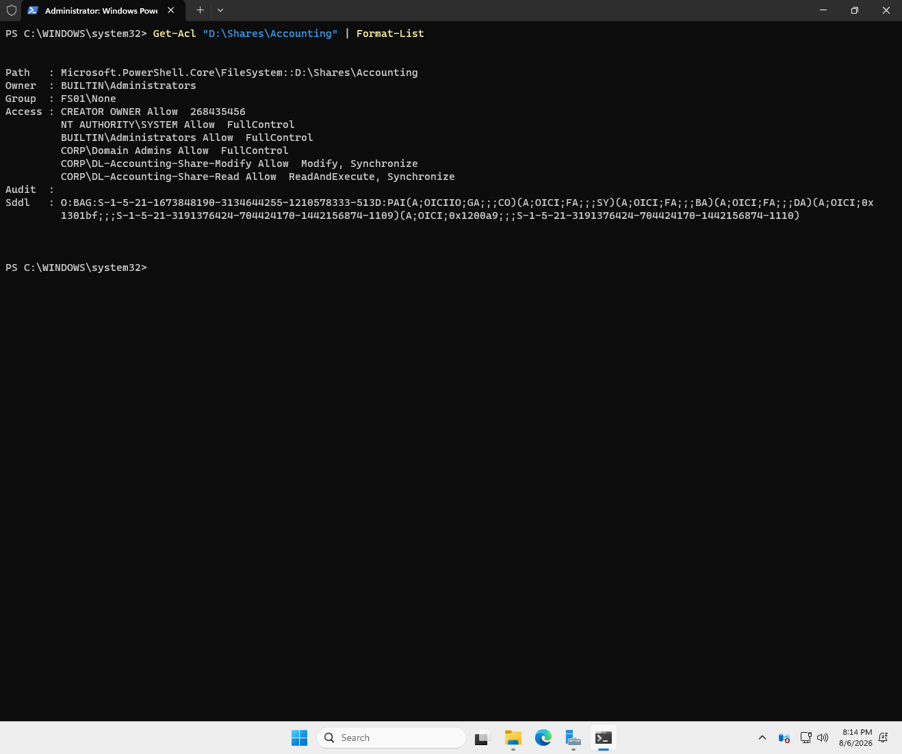
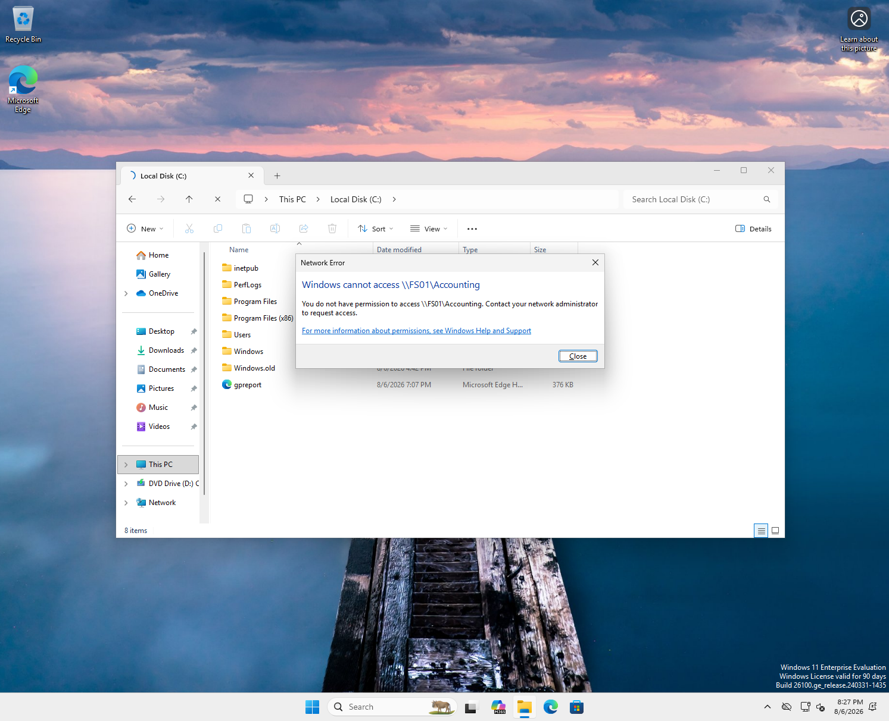

# Phase 7 — File server and permissions

**Status:** Complete  ·  **Date completed:** 2026-08-06  ·  **Systems:** FS01

> Build guide reference: Guide Part 10

---

## Objective

Implement least-privilege file share access using the AGDLP model, and enable the object access auditing that makes a control review possible.

---

## Storage layout

FS01 was built with a single 60 GB system disk. A second 40 GB virtual disk was added and initialised as `D:` before any shares were created.

```powershell
Get-Disk | Where-Object PartitionStyle -eq 'RAW' |
  Initialize-Disk -PartitionStyle GPT -PassThru |
  New-Partition -DriveLetter D -UseMaximumSize |
  Format-Volume -FileSystem NTFS -NewFileSystemLabel "Data" -Confirm:$false
```

Keeping data off the OS volume is standard practice for a file server: a runaway share cannot fill the system drive and take the server down, the volumes can be sized and backed up independently, and the OS can be rebuilt without touching the data.

**A failure worth recording here.** Before the data disk existed, `D:` was the CD-ROM drive with the Windows ISO still mounted. Folder creation failed with access denied, which is correct — an ISO is read-only. `New-SmbShare` was then run anyway and **reported success**, returning a formatted table showing paths that did not exist. Three shares were registered against nothing. The shares were removed and rebuilt after the volume was in place.

---

## Share and NTFS layers

Share permissions are left open to Authenticated Users; all enforcement happens at NTFS.

Windows evaluates share and NTFS permissions independently and applies whichever is more restrictive. Managing both means every change has to be made twice and reconciled, and any discrepancy between them becomes a source of confusion later. Enforcing entirely at NTFS gives one layer to audit and one layer to change.

This has a direct consequence for reading someone else's environment: finding `Everyone: Full Control` on a share is not automatically a finding. It is a finding only once the NTFS layer has been examined and found equally permissive.

---

## AGDLP implementation

| Share | Domain local groups on the ACL |
|---|---|
| `D:\Shares\Accounting` | `DL-Accounting-Share-Modify` (Modify), `DL-Accounting-Share-Read` (ReadAndExecute) |
| `D:\Shares\HR` | `DL-HR-Share-Modify` (Modify) |
| `D:\Shares\Public` | `DL-Public-Share-Modify` (Modify) — applied during remediation |



Only domain local groups and Domain Admins appear on the ACL. No individual users, no global groups. To grant someone access to accounting data you add them to `GG-Accounting`; the file permission itself is never touched again.

Inheritance is broken on each share root and the broad principals — `Everyone`, `Authenticated Users`, `BUILTIN\Users` — are removed explicitly. The `PAI` flag at the start of the SDDL confirms this: protected, and no longer inheriting from the volume root.

**On the regex used to strip those entries.** It is anchored (`Everyone$`, `\\Authenticated Users$`, `\\Users$`) rather than matching the bare substring. An unanchored match on `Users` would also match a legitimate group such as `DL-HR-Users-Modify`, silently removing a permission that was meant to stay. On a script that deletes access entries, that is a bad failure mode.

---

## Negative testing



A Sales user (`jhalpert`, member of `GG-Sales`) attempting to open `\\FS01\Accounting` receives a permissions error.

Testing the denial matters more than testing the grant. A share that opens for the person who configured it proves very little; a share that correctly refuses someone who should not have access proves the permission model is actually doing selective work.

---

## Object access auditing

A SACL was applied to the Accounting and HR shares auditing Modify and Delete, both success and failure, for Everyone.

```powershell
$acl = Get-Acl $path -Audit
$auditRule = [System.Security.AccessControl.FileSystemAuditRule]::new("Everyone","Modify,Delete","ContainerInherit,ObjectInherit","None","Success,Failure")
$acl.AddAuditRule($auditRule)
Set-Acl -Path $path -AclObject $acl
```

**Auditing has two independent layers and both are required.** The advanced audit policy from Phase 6 enables the Object Access category across all endpoints. The SACL specifies which objects within that category are actually watched. Neither works alone, which is why "auditing is enabled but there are no events" is one of the most common Windows questions there is.

**Failures are audited for Everyone deliberately.** A denied access attempt against financial data is a more interesting event than a successful one — it means either the permissions are wrong or someone is exploring where they should not be, and both are worth knowing.

**A destructive interaction found the hard way.** Applying the SACL first and then running the DACL block wiped the audit configuration entirely. `Get-Acl` without `-Audit` returns a security descriptor with no audit section, and writing that back removes the SACL with no error and no warning. The order matters: DACL first, then SACL. Verification is by checking for an `S:` section in the SDDL rather than reading the formatted `Audit :` field, which is easy to misinterpret.

**Confirmed producing events.** Creating and deleting a test file in the Accounting share generated event 4663 three times — `WriteData` on creation, `ReadAttributes` on inspection, and `DELETE` — each recording the account, the process (`powershell.exe`), and the timestamp.

Worth noting the volume this implies. Three lines of PowerShell produced six events, several of them generated by simply reading the security descriptor with `Get-Acl`. A department of forty people working in that share all day would generate thousands. This is why production deployments audit failures broadly but scope success auditing to sensitive locations only, and why log retention becomes its own cost.

---

## Access review

Findings and remediation evidence: [`audit/findings-register.md`](../audit/findings-register.md)

---

## Problems encountered

Documented above: the CD-ROM occupying `D:`, `New-SmbShare` reporting success against non-existent paths, and the SACL being silently overwritten by a subsequent DACL write.

---

## Verification

| Check | Command | Result |
|---|---|---|
| Only DL groups on the ACL | `Get-Acl "D:\Shares\Accounting" \| Format-List` | `DL-` groups and Domain Admins only |
| Inheritance broken | SDDL begins `D:PAI` | Confirmed |
| SACL present | `(Get-Acl $path -Audit).Sddl` | Ends with `S:PAI(AU;OICISAFA;...)` |
| Auditing generating events | `Get-WinEvent -LogName Security` filtered to 4663 | Create, read, delete all logged |
| Cross-department access denied | Open `\\FS01\Accounting` as `jhalpert` | Access denied |
