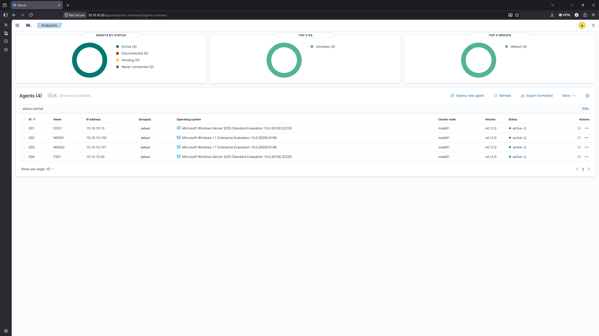
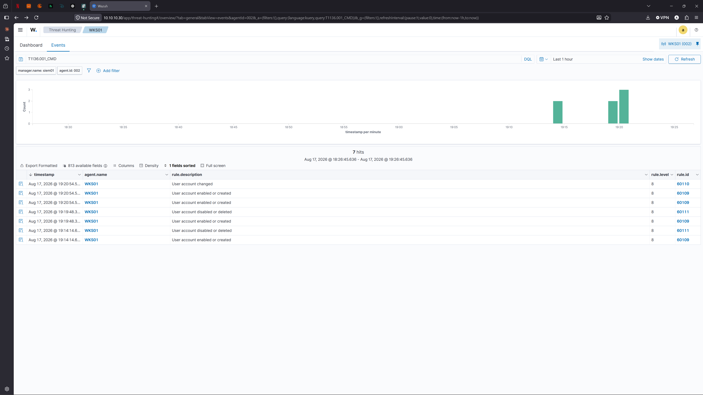
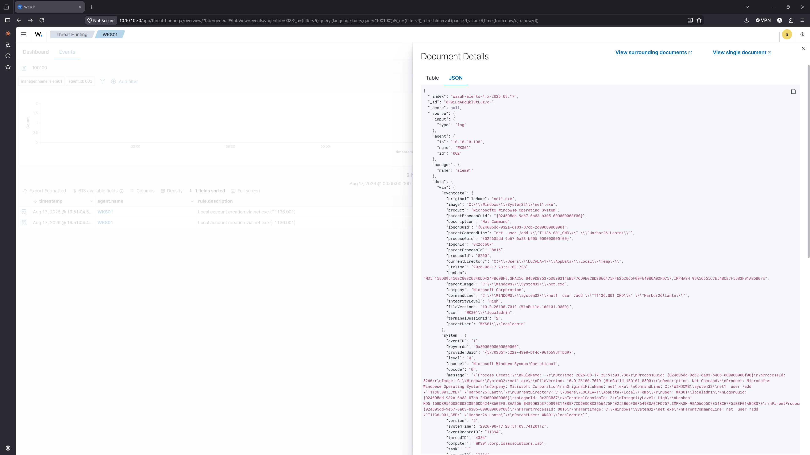
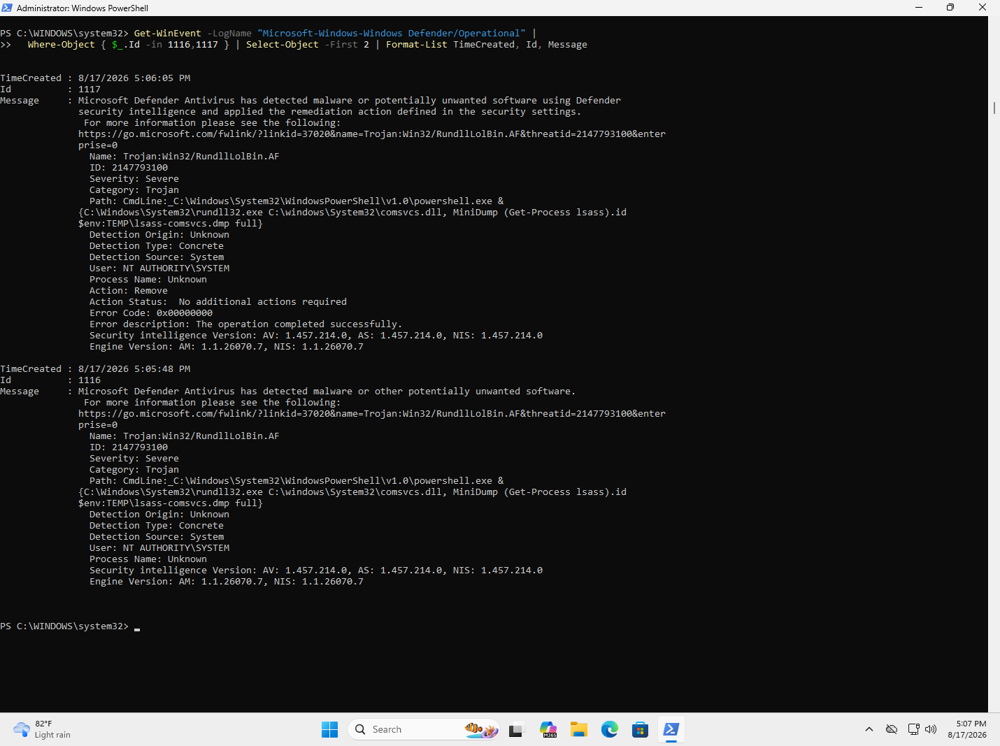

# Phase 8 — Logging and detection

**Status:** Complete  ·  **Date completed:** 2026-08-17  ·  **Systems:** All + SIEM01

> Build guide reference: Guide Part 11

---

## Objective

Deploy host telemetry across every endpoint, aggregate it centrally, execute real attack techniques against the environment, and write detections that fire on them.

---

## Architecture

| Host | Role | OS | IP |
|---|---|---|---|
| SIEM01 | Wazuh manager, indexer, dashboard | Ubuntu Server 24.04 LTS | 10.10.10.30 |
| DC01, FS01, WKS01, WKS02 | Wazuh agents + Sysmon | Windows Server 2025 / Windows 11 | see [architecture](00-architecture.md) |



All four endpoints active, no disconnected or pending agents.

**On the Ubuntu version.** Wazuh's documentation lists supported Ubuntu releases as 16.04 through 24.04. Although 26.04 LTS was available, support for it was still in progress in the Wazuh repository at the time of build. Detection work already carries version-specific unknowns around rule syntax and decoder field names, and running on an unsupported base OS would have made it impossible to tell whether a failure was mine or the platform's.

---

## Telemetry sources

| Source | Provides |
|---|---|
| Sysmon | Process creation with parent process and hashes, network connections, registry events, process access |
| Windows Security log | Authentication, account management, object access — configured in [Phase 6](06-group-policy.md) |
| Windows Defender Operational log | Threat detections and remediation actions |

**Why Sysmon rather than native logging alone.** The parent process relationship is the addition that matters. Windows Security event 4688 records that a process started; Sysmon Event 1 records what launched it. That distinction is the whole basis of the T1136.001 detection below.

---

## Sysmon deployment

Sysmon was deployed with the SwiftOnSecurity `sysmon-config` baseline, source version 74 dated 2021-07-08. The default Sysmon configuration logs almost nothing useful and generates significant volume doing it.

**Deployment was attempted via Group Policy startup script and abandoned after five distinct failures.** See [FL-004](failure-log.md). Sysmon was installed manually on all four endpoints to unblock the detection work.

**What the manual fallback cost.** It required interactive logon to each host, which does not scale and directly contradicts the credential handling model documented in [Phase 5](05-client-onboarding.md). In a production environment this would be handled by an endpoint management platform, configuration management such as Ansible, or by including Sysmon in the base image. PowerShell remoting would also have worked and was not used because WinRM is not enabled on the Windows 11 clients.

---

## Agent configuration

Wazuh agents do not collect the Sysmon event channel by default. Each agent required an explicit entry in `ossec.conf`:

```xml
<localfile>
  <location>Microsoft-Windows-Sysmon/Operational</location>
  <log_format>eventchannel</log_format>
</localfile>
```

Confirmed by the agent log rather than by searching the dashboard:

```
wazuh-agent: INFO: (1951): Analyzing event log: 'Microsoft-Windows-Sysmon/Operational'.
```

**Why the dashboard is the wrong place to verify this.** Wazuh indexes alerts, not raw events. A process creation matching no rule is evaluated and discarded. Searching for a benign process such as `notepad.exe` returns nothing whether the channel is collected or not, so the search proves nothing either way. The agent log is the authoritative source.

**One gap worth recording.** The default Security channel configuration includes a query that excludes event 4663, which is the object access event generated by the SACLs configured on the file shares in [Phase 7](07-file-server-and-permissions.md). Those events are therefore not reaching the SIEM as configured.

---

## T1136.001 — Create Account: Local Account

**Executed:** Atomic Red Team test 4, `net user /add` via command prompt, on WKS01.

### Execution constraints

The technique as written could not execute in this environment. Two independent constraints intersected:

- The test's default password contains the account name it creates. Windows complexity rejects any password containing three or more consecutive characters from the username.
- The domain password policy configured in [Phase 6](06-group-policy.md) sets a 14-character minimum, which propagates to the local SAM on domain-joined machines.
- `net user` prompts interactively when a password exceeds 14 characters, a legacy warning about pre-Windows 2000 clients. The Atomic framework cannot answer an interactive prompt and times out.

The viable password length is therefore exactly 14 characters. An attacker would adapt in seconds by using `New-LocalUser` instead, which has no legacy prompt, but the out-of-the-box technique fails.

The attack never got detected because it never worked. My own password policy blocked it.

That's a preventive control doing its job. Same idea as in my findings register: preventive controls stop something bad from happening at all, detective controls find bad things that policy lets through. What I didn't expect is that I set that password policy back in Phase 6 for normal password hygiene, not to stop attacks, and it ended up stopping one anyway.

It wouldn't hold up against a real attacker though. They'd just switch to New-LocalUser, which doesn't have the legacy prompt problem. But it does mean the technique as written doesn't run in my environment, and that's worth knowing.

### Telemetry produced

Reading the raw Sysmon event before writing any rule revealed the process chain:

```
cmd.exe /c net user /add "T1136.001_CMD" "<password>"
  └─ net.exe    (thin wrapper, does almost nothing)
       └─ net1.exe    (performs the actual operation)
```

**`net.exe` delegates to `net1.exe`.** A detection written against `net.exe` alone catches the parent, but anything invoking `net1.exe` directly would not match. This is only visible by reading the actual event rather than assuming the binary name.

The full command line is present in the event, including the password in plaintext. This is the direct consequence of the command line auditing tradeoff documented in [R-06](06-group-policy.md): the setting that makes the technique detectable also writes credentials into a log more people can read than should.

### Built-in rule coverage



Wazuh's default ruleset fired on the Security log events: rule 60109 (account enabled or created), 60110 (account changed), 60111 (account disabled or deleted), all at level 8.

**The failed attempts are also visible, and they look different from the success.** Each password rejection produced a create event followed immediately by a delete event within the same second — Windows creates the account object before applying the password and rolls it back on failure. Legitimate administration does not create and immediately remove accounts. That create-delete pair repeated over time is the signature of an attacker probing password policy.

**One gap:** the non-elevated attempt produced no Security log events at all, because `net user` never reached the account database. Privilege escalation failures are invisible at this layer and require process creation telemetry to catch.

### Custom rule

No built-in rule fired on the Sysmon process creation events. Rule 100100 was written against them:

```xml
<rule id="100100" level="12">
  <if_group>sysmon_event1</if_group>
  <field name="win.eventdata.image" type="pcre2">(?i)\\net1?\.exe$</field>
  <field name="win.eventdata.commandLine" type="pcre2">(?i)user\s+/add</field>
  <description>Local account creation via net.exe (T1136.001)</description>
  <mitre>
    <id>T1136.001</id>
  </mitre>
</rule>
```

`net1?\.exe$` matches both binaries. The `\\` anchors to a path separator so the pattern cannot match an unrelated binary ending in the same string.


Two hits 100 milliseconds apart — `net.exe` and `net1.exe` — confirming the delegation.



The alert carries the full command line, parent image, integrity level, user, and file hashes. Enough context to investigate without pivoting to another tool.

**Rule development took four attempts.** See [FL-005](failure-log.md). The last of these is the important one: the rule loaded without error and matched nothing, because Wazuh uses OS_Regex by default rather than PCRE2.

---

## T1003.001 — OS Credential Dumping: LSASS Memory

**Attempted:** Atomic Red Team test 2, LSASS dump via `comsvcs.dll`, on WKS01.

This variant uses `rundll32.exe` to call a signed Microsoft DLL that ships with Windows. There is no malicious binary to signature, which makes it a living-off-the-land technique and a harder detection problem than the account creation above.

### Telemetry gap found before testing

Detecting LSASS access requires Sysmon Event ID 10, ProcessAccess. Checking the running configuration before executing anything:

```
- ProcessAccess    onmatch: include    combine rules using 'Or'
```

**`onmatch="include"` with no filter rules beneath it logs nothing.** The section is present but inert. Confirmed empirically by grouping 2,000 events by ID — event 10 did not appear at all.

The SwiftOnSecurity configuration, one of the most widely deployed Sysmon baselines in use, ships with no LSASS access monitoring. Every credential dumping variant in the Atomic catalogue would have executed with no process access telemetry recorded.

Event 10 makes a lot of noise. I saw 13 LSASS accesses in 30 seconds on a machine that wasn't doing anything, so I get why the config authors turned it off. That's a reasonable call, not a mistake.

The problem is what it means. A lot of organizations use this config, and out of the box none of them are collecting the data you'd need to catch credential dumping, which is one of the most important attacks in Windows. If you deployed this and assumed you had coverage, you'd be wrong and nothing would tell you.

I only caught it because I checked whether the data was there before writing a rule against it. If I'd done it the other way around, I would have written the rule, seen no alerts, and spent an hour thinking my regex was broken.

Scoped fix, targeting LSASS only rather than logging all process access:

```xml
<ProcessAccess onmatch="include">
  <TargetImage condition="image">lsass.exe</TargetImage>
</ProcessAccess>
```

Event 10 began appearing within seconds of applying the updated config.

### Baseline

Before executing the attack, normal LSASS access was recorded:

| Source | GrantedAccess | Count |
|---|---|---|
| `MsMpEng.exe` (Defender) | 0x1000 | 12 |
| `MsMpEng.exe` (Defender) | 0x101000 | 1 |
| `svchost.exe` via `sysmain.dll` | 0x2000 | — |
| `svchost.exe` via `lsm.dll` | 0x1000 | — |

Three legitimate sources, all well below the `0x1010` and `0x1410` values that memory reading requires. Establishing this before running the attack is what makes the resulting rule specific rather than an alert on all LSASS access.

### Result: prevented, not detected



Microsoft Defender blocked the technique at execution:

```
Name:     Trojan:Win32/RundllLolBin.AF
Severity: Severe
Category: Trojan
Path:     CmdLine:_C:\Windows\System32\WindowsPowerShell\v1.0\powershell.exe &
          {C:\Windows\System32\rundll32.exe C:\windows\System32\comsvcs.dll,
           MiniDump (Get-Process lsass).id $env:TEMP\lsass-comsvcs.dmp full}
Action:   Remove
```

Detection at 17:05:48, remediation at 17:06:05.

**The detection matched on the command line, not on a file.** Both `rundll32.exe` and `comsvcs.dll` are signed Microsoft binaries. The signature name encodes the technique itself: Rundll, LolBin.

**No Sysmon Event 10 was generated by `rundll32.exe`.** The block was fast enough that the process never opened a handle to LSASS. The detection layer was never reached.

Prevention worked and detection never had to do anything. That's the order you want, and if I only cared about whether my lab was safe I could stop there.

But the telemetry gap still matters. Defender can get disabled or misconfigured or bypassed, and if that happened, detection would be the only thing left and it wouldn't have existed. The whole point of layering is that each layer needs to work when the one in front of it doesn't.

---

## Problems encountered

- [FL-004 — GPO Sysmon deployment, five silent failures](failure-log.md)
- [FL-005 — Custom rule loaded cleanly and matched nothing](failure-log.md)

---

## Verification

| Check | Command | Result |
|---|---|---|
| All agents reporting | `agent_control -l` on SIEM01 | 4 agents Active |
| Sysmon running on all endpoints | `Get-Service Sysmon64` | Running on DC01, FS01, WKS01, WKS02 |
| Sysmon channel collected | agent `ossec.log` | Analyzing `Microsoft-Windows-Sysmon/Operational` |
| Pipeline end to end | failed logon test | Alerts visible in dashboard |
| ProcessAccess enabled | event ID grouping | Event 10 present after config fix |
| Custom rule loads | `wazuh-analysisd -t` | No errors |
| Custom rule fires | technique re-executed | 2 hits on rule 100100, level 12 |

---

## Not implemented

**T1059.001 and T1053.005** were in the original scope and were not executed. T1003.001 was substituted for both, on the basis that credential dumping is a higher-value technique than either and that two techniques documented thoroughly is worth more than three documented thinly.

**Network telemetry** is out of scope for this phase entirely. Zeek or Suricata feeding the same SIEM would complement the host telemetry here, and is a natural extension.
